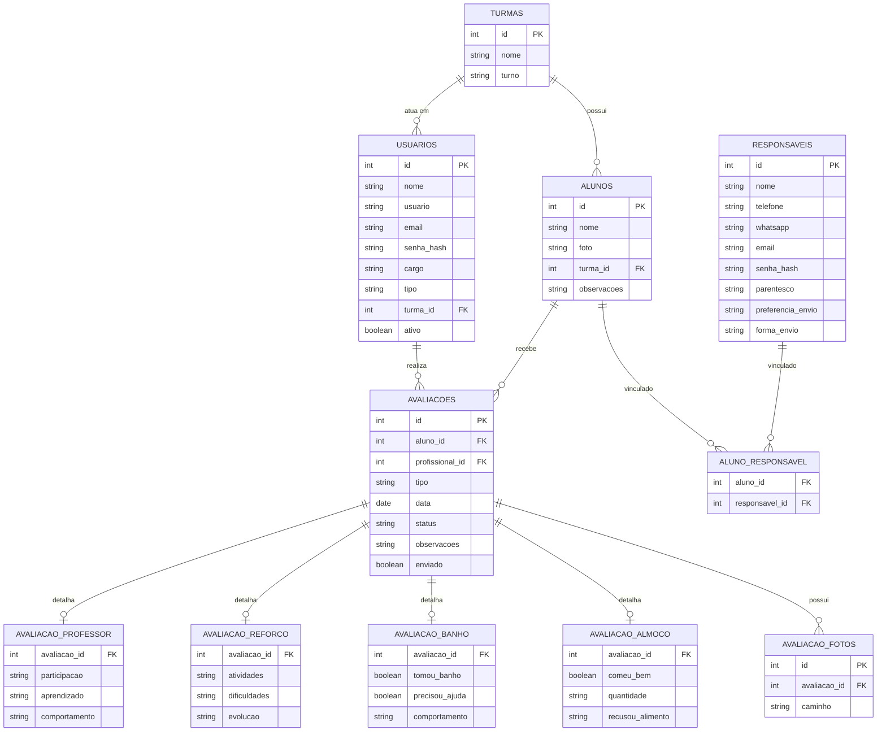

# DER - Diagrama Entidade-Relacionamento
## CheckUp Escolar

O diagrama abaixo está no formato Mermaid (renderiza automaticamente no GitHub e em diversos editores, como o VS Code com a extensão "Markdown Preview Mermaid Support").

## Descrição das entidades

- **turmas**: representa cada turma da escola de tempo integral.
- **usuarios**: administrador e profissionais (professor, reforço, banho, almoço) que acessam o sistema.
- **responsaveis**: pais/responsáveis, que também podem acessar o sistema para consultar o resumo do dia e configurar preferências de envio.
- **alunos**: os estudantes acompanhados no sistema.
- **aluno_responsavel**: tabela associativa (N:N) entre alunos e responsáveis, pois um aluno pode ter mais de um responsável e um responsável pode ter mais de um filho matriculado.
- **avaliacoes**: tabela central que guarda os dados comuns de qualquer avaliação diária (aluno, profissional, tipo, data, status).
- **avaliacao_professor / avaliacao_reforco / avaliacao_banho / avaliacao_almoco**: tabelas de detalhe (1:1 com avaliacoes), cada uma armazenando os campos específicos do formulário daquele profissional.
- **avaliacao_fotos**: fotos anexadas em cada avaliação (1:N), pois cada avaliação pode ter mais de uma foto.

O script completo de criação das tabelas está em `backend/database/schema.sql`.
