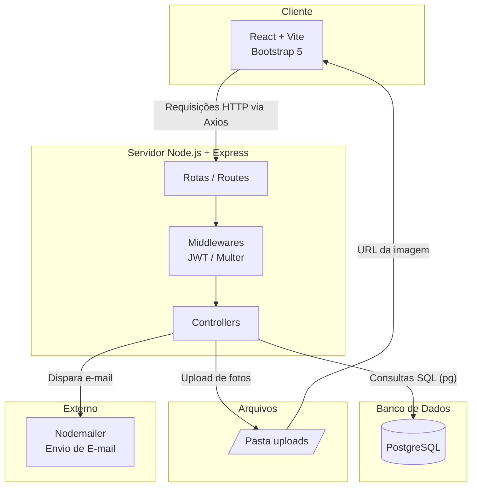

# Arquitetura do Sistema - CheckUp Escolar

## Camadas do sistema

1. **Frontend (React + Vite)**: interface web responsiva construída com componentes React e estilizada com Bootstrap 5. Consome a API através do Axios, com o token JWT enviado automaticamente em cada requisição.

2. **Backend (Node.js + Express)**: organizado em `routes` (definição dos endpoints), `controllers` (regras de negócio) e `middleware` (autenticação JWT e upload de arquivos com Multer).

3. **Banco de dados (PostgreSQL)**: acessado diretamente através do driver `pg`, sem uso de ORM, com consultas SQL escritas manualmente nos controllers.

4. **Armazenamento de arquivos**: as fotos enviadas pelos profissionais são salvas localmente na pasta `backend/uploads` e servidas como arquivos estáticos pelo próprio Express.

5. **Envio de e-mail (Nodemailer)**: ao finalizar uma avaliação, o sistema verifica a preferência de cada responsável (por etapa ou resumo do final do dia) e envia o e-mail correspondente.

## Justificativa das escolhas técnicas

- **Sem ORM (Prisma/Sequelize)**: optou-se por SQL puro com o driver `pg`,deixando explícitas as consultas e os relacionamentos.
- **JWT para autenticação**: simples de implementar e amplamente utilizado.
- **Armazenamento local de arquivos**: dispensa a necessidade de serviços em nuvem pagos, mantendo o projeto executável apenas com Node.js e PostgreSQL instalados localmente.
- **Bootstrap 5**: fornece componentes prontos (modais, tabelas, formulários, cards) sem a necessidade de escrever CSS complexo, acelerando o desenvolvimento da interface.
