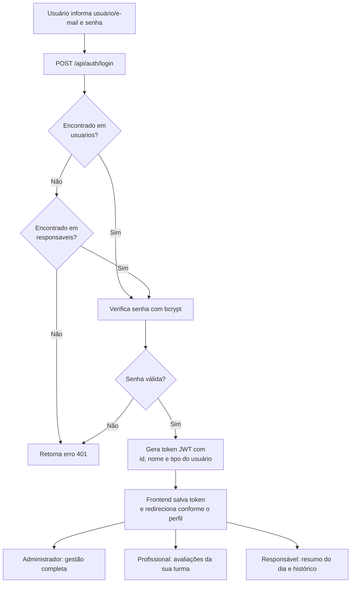

# Fluxograma de Funcionamento - CheckUp Escolar

## Fluxo geral (preenchimento e envio de uma avaliação)

```mermaid
flowchart TD
    A[Profissional realiza login] --> B[Acessa Dashboard / Avaliações do dia]
    B --> C[Seleciona o aluno da sua turma]
    C --> D{Avaliação de hoje<br/>já existe?}
    D -- Não --> E[Sistema cria avaliação<br/>com status "pendente"]
    D -- Sim --> F[Sistema carrega avaliação existente]
    E --> G[Profissional preenche o formulário<br/>específico do seu cargo]
    F --> G
    G --> H{Deseja salvar<br/>rascunho ou finalizar?}
    H -- Salvar rascunho --> I[Dados salvos,<br/>status continua "pendente"]
    I --> G
    H -- Finalizar --> J[Sistema marca avaliação<br/>como "concluída"]
    J --> K[Sistema anexa fotos enviadas]
    K --> L{Preferência do<br/>responsável?}
    L -- Por etapa --> M[Envia e-mail imediatamente<br/>com esta avaliação]
    L -- Final do dia --> N{Todos os formulários<br/>do dia foram concluídos?}
    N -- Não --> O[Aguarda demais profissionais<br/>finalizarem suas avaliações]
    N -- Sim --> P[Envia e-mail com o<br/>resumo completo do dia]
    M --> Q[Fim]
    P --> Q
    O --> Q
```

## Fluxo de login e controle de acesso


